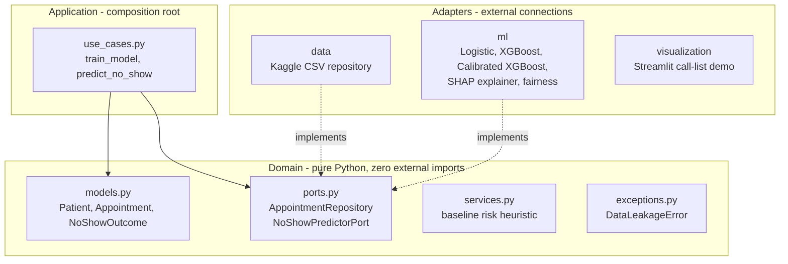
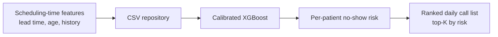
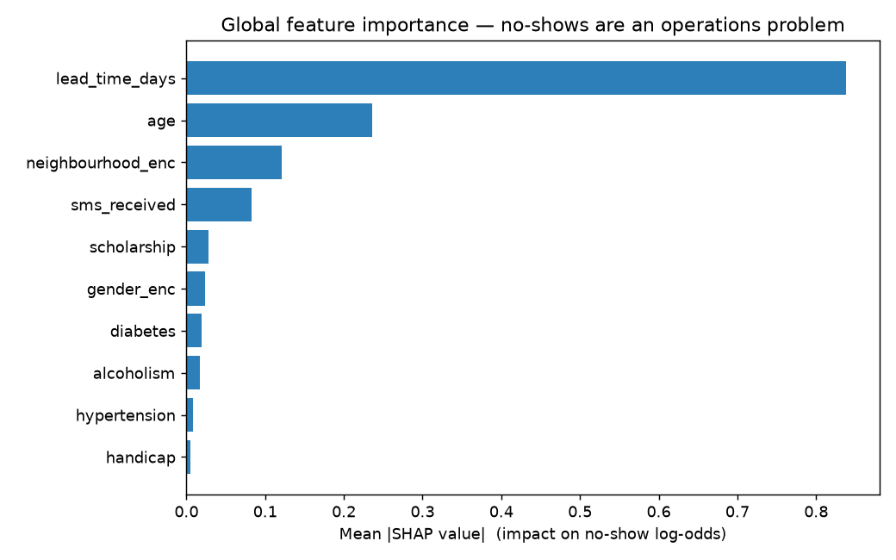
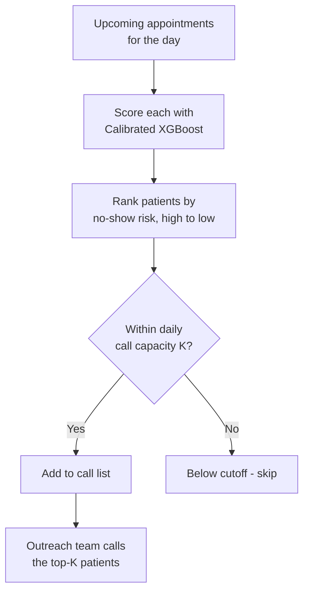

# Healthcare Appointment No-Show Predictor

Predict medical appointment no-shows at booking time so clinic outreach teams can target reminders, recover slots, and reduce revenue loss. Built with Hexagonal Architecture, calibration-focused modeling, explicit data leakage prevention, SHAP explainability, and per-slice fairness reporting.

[](https://www.python.org/downloads/)
[](./tests/)
[](https://github.com/psf/black)

> **Disclaimer:** This project uses the [Kaggle Medical Appointments](https://www.kaggle.com/datasets/joniarroba/noshowappointments) public benchmark dataset. It is not connected to any health system or employer data.

---

## Project Overview

An outreach team at a clinic wants to reduce appointment no-shows. Each morning, they need a ranked **daily call list** of patients most likely to miss their upcoming appointments, so they can proactively call and confirm or reschedule.

This system:
1. Predicts no-show probability using only **scheduling-time features** (no post-appointment data)
2. Ranks patients by risk → generates a **capacity-constrained top-K call list**
3. Explains each prediction with **SHAP**, framed as an operations problem, not a clinical one ([ADR-012](docs/adr/ADR-012-shap-narrative.md))
4. Reports **fairness** (FPR/FNR + calibration) across demographic slices ([ADR-009](docs/adr/ADR-009-fairness-reporting.md))
5. Ships an interactive **Streamlit call-list demo** ([ADR-010](docs/adr/ADR-010-streamlit-demo.md))

### Key Finding

> **"This is an operations problem, not a clinical one."** SHAP confirms it quantitatively: `lead_time_days` (mean |SHAP| 0.84) and `age` (0.24) dominate, while the clinical features (diabetes 0.019, hypertension 0.008, handicap 0.005) are the three *least* important of all. Scheduling practices drive no-shows far more than patient health conditions.

### Results at a glance

| What | Result |
|------|--------|
| Ranking quality (calibrated XGBoost) | AUC **0.724**, ECE **0.007** (5-fold GroupKFold) |
| Top no-show driver (SHAP) | `lead_time_days`, ~3.5x the next feature |
| Fairness | Gender parity (FPR gap 0.002); age & SMS-confound gaps surfaced honestly |
| Calibration within every slice | ECE ≤ 0.022 per demographic group |
| Projected value (labeled what-if) | ~**$44K/month** recoverable (20 calls/day, $200/slot) |
| Quality gates | **91 tests**, mypy strict, 81% coverage |

---

## Project Journey

The full pipeline is built and tested: Phase 0 through the Phase 2 explainability, fairness, and demo.

```mermaid
flowchart LR
    subgraph DONE["Built and tested - Phases 0 to 1"]
        direction LR
        J0["Domain pivot<br/>readmission to no-show<br/>ADR-001"]
        J1["EDA gate<br/>20.2 pct no-show, AUC 0.656<br/>GO decision"]
        J2["Leakage-safe features<br/>scheduling-time only<br/>DataLeakageError guard"]
        J3["SMS confound handled<br/>Simpson paradox, documented<br/>ADR-006"]
        J4["Validation<br/>GroupKFold by PatientId<br/>plus temporal holdout, ADR-011"]
        J5["Model lineup<br/>LogReg, XGBoost,<br/>Calibrated XGBoost"]
        J6["Calibration win<br/>Brier 0.214 to 0.145<br/>ECE 0.247 to 0.007"]
        J0 --> J1 --> J2 --> J3 --> J4 --> J5 --> J6
    end
    subgraph PHASE2["Built and tested - Phase 2"]
        direction LR
        P1["SHAP explanations<br/>lead time and age dominate<br/>ADR-012"]
        P2["Fairness slices<br/>FPR/FNR + calibration<br/>ADR-009"]
        P3["Streamlit call-list demo<br/>ADR-010"]
        P4["Business impact model<br/>ADR-004"]
        P1 --> P2 --> P3 --> P4
    end
    J6 --> P1
```



*The full pipeline is built and tested: the domain pivot through the calibrated model, then SHAP explainability, per-slice fairness, the business-impact projection, and the Streamlit call-list demo.*

---

## Architecture

Hexagonal (Ports and Adapters), with all dependencies pointing inward toward the domain.



Data flow at prediction time:



**Layout:**

```
healthcare-noshow-predictor/
├── domain/                 # Pure Python, zero external imports
│   ├── models.py          # Patient, Appointment, NoShowOutcome
│   ├── ports.py           # AppointmentRepository, NoShowPredictorPort
│   ├── services.py        # Baseline no-show risk heuristic
│   └── exceptions.py      # DataLeakageError, domain errors
├── adapters/              # External connections
│   ├── data/              # KaggleAppointmentCSVRepository
│   ├── ml/                # Logistic, XGBoost, CalibratedXGBoost,
│   │                      #   shap_explainer, fairness, evaluation
│   └── visualization/     # call_list ranking (demo)
├── application/           # Orchestration (composition root)
│   └── use_cases.py       # train_model(), predict_no_show()
├── scripts/               # run_training, run_phase2, export_demo
├── streamlit_app.py       # Interactive call-list demo (Community Cloud)
├── demo/                  # Precomputed scored_appointments.csv for the demo
├── tests/                 # Unit + property-based (Hypothesis), 91 tests
├── notebooks/             # EDA only, no production logic
├── docs/adr/              # 12 Architecture Decision Records
└── reports/               # EDA gate, model metrics, fairness, shap/
```

**Dependency rule:** All dependencies point inward. Domain imports nothing from adapters or application.

---

## Dataset

| Property | Value |
|----------|-------|
| Source | [Kaggle Medical Appointments](https://www.kaggle.com/datasets/joniarroba/noshowappointments) |
| File | `KaggleV2-May-2016.csv` |
| Rows | 110,527 appointments |
| Patients | 62,299 unique (39% have multiple appointments) |
| Target | No-show rate: **20.2%** |
| Period | April 29 – June 8, 2016 |

**Leakage rule:** All features must be knowable at scheduling time. `DataLeakageError` raised if post-appointment features detected.

**SMS confound:** SMS_received=1 correlates with *higher* no-show rate (Simpson's paradox). SMS is sent as intervention to high-risk patients with longer lead times. Included as feature with documented caveat, not a causal predictor. See [ADR-006](docs/adr/ADR-006-sms-confound.md).

---

## EDA Gate Results

| Gate | Criterion | Result | Status |
|------|-----------|--------|--------|
| Target rate | 15–30% | 20.2% | ✅ |
| Logistic AUC | ≥ 0.65 | 0.6558 | ✅ |
| Feature dominance | No single >80% | max 32.9% | ✅ |
| Missing values | 0 | 0 | ✅ |
| Volume | ≥ 50k | 110,527 | ✅ |

Full report: [`reports/eda_gate.md`](reports/eda_gate.md)

---

## Model Lineup

| Model | Purpose | Identity |
|-------|---------|----------|
| Logistic Regression | Linear baseline | Interpretable, calibrated by default |
| XGBoost | Nonlinear gains | How much does tree-based modeling buy? |
| Calibrated XGBoost | Probability quality | **This project's differentiator**: isotonic calibration for ranked call lists |

**Evaluation:** AUC, F1, Brier score, precision@K, ECE (Expected Calibration Error)

**Validation:** 5-fold GroupKFold (by PatientId) + temporal holdout (June). See [ADR-011](docs/adr/ADR-011-split-strategy.md).

### Results (5-fold GroupKFold CV)

| Model | AUC | F1 | Brier | ECE | Precision@20 |
|-------|-----|-----|-------|-----|-------------|
| Logistic | 0.6565 ± 0.0045 | 0.4005 ± 0.0029 | 0.1550 ± 0.0024 | 0.0245 ± 0.0018 | 0.38 ± 0.11 |
| XGBoost | 0.7236 ± 0.0033 | 0.4459 ± 0.0064 | 0.2144 ± 0.0009 | 0.2471 ± 0.0046 | 0.54 ± 0.09 |
| **Calibrated XGBoost** | **0.7237 ± 0.0031** | **0.4453 ± 0.0065** | **0.1452 ± 0.0017** | **0.0070 ± 0.0011** | **0.48 ± 0.08** |

### Temporal Holdout (June 2016)

| Model | AUC | F1 | Brier | ECE |
|-------|-----|-----|-------|-----|
| Logistic | 0.6596 | 0.3856 | 0.1455 | 0.0319 |
| XGBoost | 0.7160 | 0.4165 | 0.2155 | 0.2635 |
| **Calibrated XGBoost** | **0.7158** | **0.4164** | **0.1377** | **0.0156** |

**Key insight:** Calibration preserves AUC (0.724) while improving probability quality. Brier drops from 0.214 to 0.145, ECE from 0.247 to 0.007. This matters for ranked call lists where probability ordering determines who gets called.

Full metrics: [`reports/model_metrics.json`](reports/model_metrics.json)

---

## Explainability (SHAP)

Global feature importance over 5,000 sampled appointments (mean |SHAP| on the XGBoost log-odds; isotonic calibration is monotonic, so the risk *ordering* the call list acts on is preserved). See [ADR-012](docs/adr/ADR-012-shap-narrative.md).



| Rank | Feature | Mean \|SHAP\| |
|------|---------|--------------|
| 1 | `lead_time_days` | 0.838 |
| 2 | `age` | 0.236 |
| 3 | `neighbourhood` | 0.121 |
| 4 | `sms_received` | 0.082 |
| 5–7 | scholarship, gender, alcoholism | < 0.03 |
| 8–10 | **diabetes, hypertension, handicap** | **< 0.02, the three least important** |

The clinical comorbidities are the lowest-impact features of all: the quantitative backing for the "operations, not clinical" framing. Per-patient attributions power the demo's drill-down. Beeswarm: [`reports/shap/shap_beeswarm.png`](reports/shap/shap_beeswarm.png); full data: [`reports/shap/global_importance.json`](reports/shap/global_importance.json).

---

## Fairness (per-slice)

Error rates and calibration by demographic slice on the June holdout (n = 26,451), at the F1-optimal threshold (0.22). See [ADR-009](docs/adr/ADR-009-fairness-reporting.md).

| Slice | Base rate | FPR | FNR | ECE |
|-------|-----------|-----|-----|-----|
| Female | 0.183 | 0.422 | 0.249 | 0.018 |
| Male | 0.188 | 0.420 | 0.245 | 0.011 |
| Age 18–34 | 0.223 | 0.509 | 0.101 | 0.016 |
| Age 55+ | 0.144 | 0.251 | 0.576 | 0.017 |
| SMS received | 0.261 | 0.769 | 0.140 | 0.021 |
| No SMS | 0.127 | 0.200 | 0.414 | 0.012 |

**Findings, surfaced not hidden:**
- **Gender: fair.** FPR gap 0.002, FNR gap 0.004.
- **Calibration holds within every slice.** Per-group ECE ≤ 0.022, not just in aggregate.
- **Age: a real disparity.** The list skews young; patients 55+ are under-flagged (FNR 0.58) because they no-show less. A limitation to monitor, not a bug.
- **SMS gap** reflects the documented Simpson's-paradox confound ([ADR-006](docs/adr/ADR-006-sms-confound.md)), now visible through the fairness lens.

Full report: [`reports/fairness.json`](reports/fairness.json).

---

## Daily Call List

Capacity-constrained top-K: the team states how many calls it can make, and the system returns that many highest-risk patients (ADR-005).



---

## Business Impact Model

A labeled *what-if* projection ([ADR-004](docs/adr/ADR-004-revenue-based-impact.md)), computed from the June holdout:

```
precision@20 (calibrated, holdout) = 0.50
recoverable_slots/day = 20 calls × 0.50    = 10
monthly_value = 10 × $200 × 22 working_days ≈ $44,000   (~$528,000/year)
```

**Assumptions labeled, not hidden:** `$200/slot` is a primary-care literature estimate (not clinic data); this is an upper bound that assumes every correctly-flagged, called no-show recovers a slot; a real pilot would apply a call-to-recovery conversion rate. Full data: [`reports/business_impact.json`](reports/business_impact.json).

---

## Interactive Demo

A Streamlit app renders a **daily call list** (pick a day + call capacity K), a **SHAP drill-down** per patient, the **fairness** tables, and the **business-impact** projection, all from precomputed artifacts, so it needs no model training or raw data at runtime.

```bash
pip install -e ".[demo]"
streamlit run streamlit_app.py
```

*Live demo: deploying to Streamlit Community Cloud (URL to follow).* Regenerate the artifacts with `python scripts/run_phase2.py && python scripts/export_demo.py`.

---

## Technology Stack

| Category | Tools |
|----------|-------|
| Language | Python 3.12+ |
| ML | scikit-learn, XGBoost |
| Explainability | SHAP (TreeExplainer) |
| Demo | Streamlit (Community Cloud) |
| Testing | pytest, Hypothesis (property-based), 91 tests |
| Quality | black, isort, mypy (strict), ruff, pre-commit |
| CI | GitHub Actions (lint, test, security) |

---

## Setup

```bash
git clone https://github.com/tirthjoship/healthcare-noshow-predictor.git
cd healthcare-noshow-predictor
pip install -e ".[dev,analysis,demo]"
pre-commit install

# Place dataset
# Download from Kaggle → data/raw/KaggleV2-May-2016.csv

# Run tests + full quality check
make test
make check

# Regenerate Phase 2 artifacts (SHAP, fairness, business impact) + demo data
python scripts/run_phase2.py
python scripts/export_demo.py

# Launch the interactive demo
streamlit run streamlit_app.py
```

---

## Project Status

| Phase | Description | Status |
|-------|-------------|--------|
| 0 | EDA gate: dataset validation | ✅ PASSED |
| 0.5 | Domain pivot: readmission to no-show | ✅ Complete |
| 1 | Adapters + model training | ✅ Complete (3 models) |
| 2 | SHAP, fairness, business impact | ✅ Complete |
| 2.5 | Streamlit call-list demo | ✅ Built (Community Cloud deploy pending) |

**91 tests** total (unit + property-based), mypy strict, 81% coverage.

---

## Architecture Decision Records

12 ADRs in [`docs/adr/`](docs/adr/):

| ADR | Decision |
|-----|----------|
| [001](docs/adr/ADR-001-pivot-to-noshow.md) | Pivot from readmission to no-show |
| [002](docs/adr/ADR-002-primary-persona.md) | Primary persona: outreach team |
| [003](docs/adr/ADR-003-daily-call-list.md) | Daily call list intervention |
| [004](docs/adr/ADR-004-revenue-based-impact.md) | Revenue-based impact ($200/slot) |
| [005](docs/adr/ADR-005-capacity-constrained-topk.md) | Capacity-constrained top-K threshold |
| [006](docs/adr/ADR-006-sms-confound.md) | SMS confound documentation |
| [007](docs/adr/ADR-007-target-encoding.md) | Target encoding (train-only) |
| [008](docs/adr/ADR-008-model-lineup.md) | Logistic → XGBoost → Calibrated XGBoost |
| [009](docs/adr/ADR-009-fairness-reporting.md) | FPR/FNR + calibration per slice |
| [010](docs/adr/ADR-010-streamlit-demo.md) | Call list + SHAP drill-down demo |
| [011](docs/adr/ADR-011-split-strategy.md) | GroupKFold + temporal holdout |
| [012](docs/adr/ADR-012-shap-narrative.md) | "Operations, not clinical" framing |

---

## Limitations

- **Public benchmark data**: not production clinical data
- **SMS confound**: SMS_received coefficient is not causal (Simpson's paradox)
- **Narrow time window**: dataset covers ~6 weeks (April–June 2016)
- **Single clinic system**: Vitória, Brazil; may not generalize to other geographies
- **No cost optimization**: threshold is capacity-based, not cost-optimized

---

## Author

**Tirth Joshi**
UBC Master of Data Science
Former Data Systems Analyst, Vancouver General Hospital

---

## License

MIT License. See [`LICENSE`](LICENSE) for details.
